- [1 riskintroanalysis](#1-riskintroanalysis)
- [2 Installation](#2-installation)
- [3 Analysis](#3-analysis)
- [4 Example 1: Tunisia](#4-example-1-tunisia)
  - [4.1 Core datasets](#41-core-datasets)
    - [4.1.1 Emission Risk Factors:](#411-emission-risk-factors)
    - [4.1.2 Epidemiological Units](#412-epidemiological-units)
  - [4.2 Analysis](#42-analysis)
    - [4.2.1 Border risk](#421-border-risk)
    - [4.2.2 Entry point risk](#422-entry-point-risk)
    - [4.2.3 Animal mobility](#423-animal-mobility)
    - [4.2.4 Road accessibility](#424-road-accessibility)
  - [4.3 Risk rescaling](#43-risk-rescaling)
  - [4.4 Non-default risks](#44-non-default-risks)
    - [4.4.1 Risk from raster file](#441-risk-from-raster-file)
  - [4.5 Summary table](#45-summary-table)

<!-- README.md is generated from README.Rmd. Please edit that file -->

# 1 riskintroanalysis

The riskintroanalysis R package provides functions to analyse the risk
of introduction of animal diseases within a geographic area. It is
intended to be useful as a stand-alone package, but also to integrate
directly into the riskintro Rshiny app. The motivation behind these
projects is to easily conduct geospatial risk analysis using existing
data from WAHIS (World Animal Health Information System).

# 2 Installation

You can install the development version of riskintroanalysis like so:

``` r
remotes::install_github("riskintroanalysis")
```

# 3 Analysis

The package provides functions for certain risk of introduction
analysis, but requires external data to be provided. The functions are
inteded to be flexible, but each analytical method requires the
corresponding data.

The RShiny app [riskintro](https://github.com/ardata-fr/riskintro)
provides a graphical interface for the following analyses.

The central datasets to each method are:

1.  **The emission risk score table**, which provides a risk of emission
    diseases (that is to say the risk of a disease spreading from that
    country). This score is based on summary of risk factors, many of
    which are available from WAHIS (see more
    [here](insert%20link%20to%20riksintrodata%20package%20docs)). This
    data exists for many countries around the world, and is augmented
    with geospatial data corresponding to each country’s administrative
    boundaries.
2.  **The area of interest**, Geospatial data defining the borders of a
    region. This is the area for which we want to know the risk of
    introduction of a disease. The most common data is that of a country
    and its administrative boundaries, including internal boundaries.
    For example, French departments, or German states.

These two datasets are used along with other data to calculate risk
scores for the following analyses:

1.  **Border lengths**: using the length of shared borders the risk of
    introduction is weighed comared to each neighbouring country and
    their risk score.
2.  **Border entry points**: using an additional dataset that defines
    broder entry points, risk of introduction is weighted by legality of
    entry point.
3.  **Animal mobility**: using an additional dataset defining legal
    animal commerce flows, risk of introduction is weighed based on the
    number of animals entering the area.

The forth analysis method does not use emission risk data, just data
from a road accesibility raster and the epidemiological units:

4.  **Road access risk**: using raster data of the world, applied to the
    area of interest, risk of introdcution is infered through road
    acces. An area more accessible by road is considered higher risk.

These methods of analysis are intended to be used together or
individually to montor is risk of introduction. This is done by ensuring
risks are using the same scale (for example between 0 and 100) and they
can easily added to a table of risk.

Additionally, some tools are provided to add other risk (such as the
ones not show above). Currently supported are pre-calculated risks or
risks from raster files. Which can be rescaled and added to the risk
table as well. This allows of the risk analyst the flexibility to add
other risks outside of the default risks.

# 4 Example 1: Tunisia

`riskintroanalysis` is intended to be used alongside `sf` geospatial
data manipulation, `dplyr` for general data manipulation, and `terra`
for raster data.

## 4.1 Core datasets

The two core datasets are emission risk factors and epidemiological
units. The first is used in three out of four analysis methods, the
second is used in all of them.

### 4.1.1 Emission Risk Factors:

Emission risk factors are used to create an overall emission risk value
that is associated with the possible spread of a disease from that
country. It is made up of multiple scores which are weighted.

Here, we create two entries in the emission risk table for Algeria and
Libya. The absence of government oversight in each area represents an
increased risk of emission. Therefore a 1 means there is additional risk
associated with this score, and a 0 means no additional risk.

``` r
library(dplyr)
library(riskintrodata)
library(riskintroanalysis)
#> Loading required package: ggplot2
library(sf)

algeria <- erf_row(
  iso3 = "DZA",
  country = "Algeria",
  disease = "Avian infectious laryngotracheitis",
  animal_category = "Domestic",
  species = "Birds",
  disease_notification = 0,
  targeted_surveillance = 1,
  general_surveillance = 0,
  screening = 1,
  precautions_at_the_borders = 1,
  slaughter = 1,
  selective_killing_and_disposal = 1,
  zoning = 1,
  official_vaccination = 1,
  last_outbreak_end_date = as.Date("30/06/2023"),
  commerce_illegal = 0L,
  commerce_legal = 0L
)

libya <- erf_row(
  iso3 = "LBY",
  country = "Libya",
  disease = "Avian infectious laryngotracheitis",
  animal_category = "Domestic",
  species = "Birds",
  disease_notification = TRUE,
  targeted_surveillance = 1,
  general_surveillance = 0,
  screening = 1,
  precautions_at_the_borders = 0,
  slaughter = 1,
  selective_killing_and_disposal = 1,
  zoning = 1,
  official_vaccination = 1,
  last_outbreak_end_date = as.Date("30/06/2019"),
  commerce_illegal = 0L,
  commerce_legal = 1
)

wahis_erf <- get_wahis_erf(
  disease = "Avian infectious laryngotracheitis",
  animal_category = "Domestic",
  species = "Birds"
)
#> ✔ WAHIS emission risk factors dataset has 62 entries for `disease = Avian infectious laryngotracheitis`, `species = Birds`, and `animal_category = Domestic`.

emission_risk_factors <- dplyr::bind_rows(
  algeria,
  libya,
  wahis_erf
)

emission_risk_table <- calc_emission_risk(emission_risk_factors = emission_risk_factors)

hist(
  emission_risk_table$emission_risk,
  main = "Histogram of emission risk score",
  xlab = "Emission risk scores"
)
```

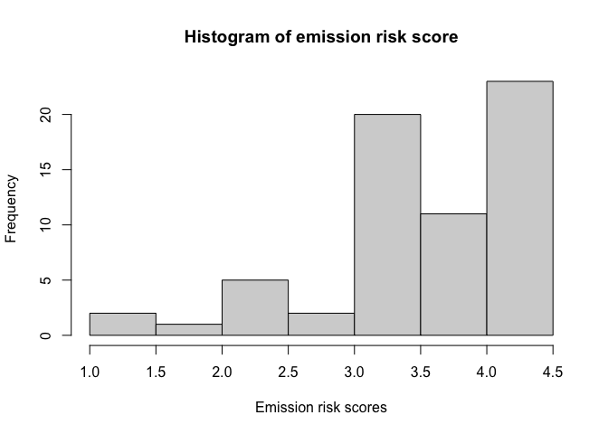

It is also useful to join the world_sf geospatial dataset to emission
risk for later.

``` r
world <- riskintrodata::world_sf

emission_risk_sf <- dplyr::left_join(
  x = world, y = emission_risk_table,
  by = c("iso3" = "iso3")
)

plot(select(emission_risk_sf, emission_risk),
  main = "Emission risk scores"
)
```

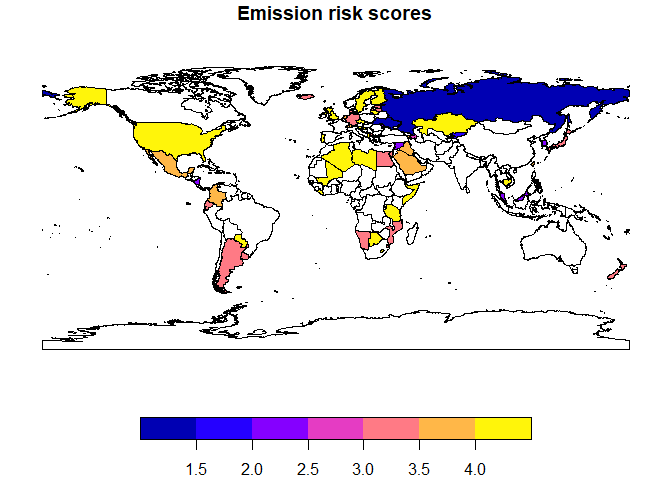

### 4.1.2 Epidemiological Units

Epidemiological units (or epi units for short) is the term used for
geographical areas of interests for analysing understand the risk of
introduction. This data has no defaults and needs to be provided by the
user, however packages like `geodata` can be used to get them. For this
example, a shapefile containing the administrative boundaries of Tunisia
exists in the `riskintrodata` package for demonstration purposes.

The Tunisia epidemiological units dataset will be essential to the
following analysis methods.

``` r
library(sf)
# Example with raw sf files, previously downloaded with geodata::gadm()
tunisia_raw <- read_sf(system.file(
  package = "riskintrodata",
  "samples", "tunisia", "epi_units", "tunisia_adm2_raw.gpkg"
))

# Apply mapping to prepare colnames and validate dataset
tunisia <- validate_dataset_content(
  x = tunisia_raw,
  table_name = "epi_units",
  eu_name = "NAME_2",
  geometry = "geom"
) |> extract_dataset()

plot(sf::st_geometry(tunisia))
```

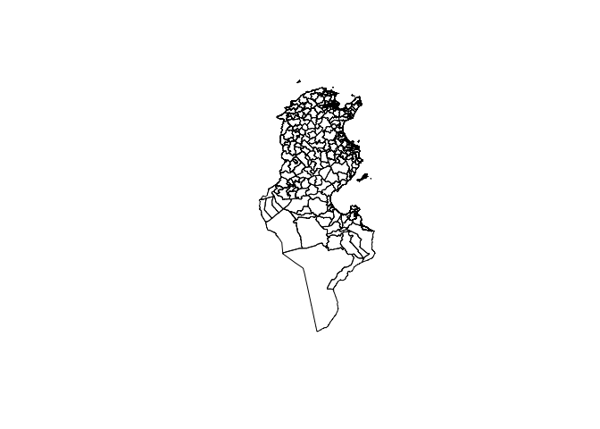

What’s left after using
`validate_dataset_content(..., table_name = "epi_units")` is the
required “epi_units” dataset that is compatible with the rest of the
analysis going forward.

## 4.2 Analysis

The 4 methods of analysis provided by the package are detailed below:

This an example of analysing the risk of introduction for Tunisian
governorates. Based off of the core datasets

### 4.2.1 Border risk

Required datasets:

1.  epi units
2.  internal neighbours table
3.  emission risk table

The border length method calculates the risk of introduction of an
animal disease for a certain species based on shared land borders. In
this example, we see Tunisia shares land borders with Algeria and Libya
(this is why entries of these two countries were added to the emission
risk table above).

Risk of introduction through land borders is the risk of emission from
of bordering countries weighted by the length of the shared border. If
an epi unit only has one bordering country with emission risk X, then
the epi units risk of introduction is also X. If two bordering countries
exist with emission risk Y ans Z, then the risk of introduction is a
weighted average of Y and Z, with more importance given to the country
with the longer border.

The analysis method starts with finding shared borders between
epidemiological units and bordering countries, which requires an
algorithm align borders.

``` r
# Run function to get shared borders
shared_borders <- calc_border_lengths(
  epi_units = tunisia
)

# Get bordering countries to display on ggplot
# (This is internal to calc_border_lengths() function)
bordering_countries <- riskintrodata::neighbours_table |>
  filter(country_id == "TUN") |>
  right_join(riskintrodata::world_sf, by = c("neighbour_id" = "iso3"))

ggplot() +
  geom_sf(data = bordering_countries, colour = "red", fill = "pink", alpha = 0.5, aes(geometry = geometry)) +
  geom_sf(data = tunisia, fill = "lightblue", colour = "blue", alpha = 0.5) +
  geom_sf(data = shared_borders, colour = "black") +
  geom_sf_label(data = shared_borders, aes(label = sprintf("%.fkm", border_length)), size = 1.5) +
  coord_sf(xlim = c(7, 12), ylim = c(30, 38), expand = FALSE)
#> Warning in st_point_on_surface.sfc(sf::st_zm(x)): st_point_on_surface may not
#> give correct results for longitude/latitude data
```

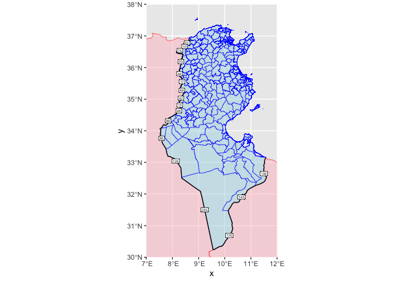

The main purpose of the function is to correct misaligned borders, as
can be seen in the overlaps and divergent borders. The epidemiological
units data is used for the “true” border as geospatial data from
different sources are rarely well aligned.

A border length has been calculated for each epi unit that a foreign
country. For most of these areas, the risk of introduction will simply
equal the emission risk of the neighbouring country, with the exception
of Tunisia’s southern most governorate. Which will have an emission risk
weighed by the border lengths or each neighbour.

``` r
ri_borders <- calc_border_risk(
  epi_units = tunisia,
  shared_borders = shared_borders,
  emission_risk = emission_risk_table
)

plot_risk(ri_borders)
```

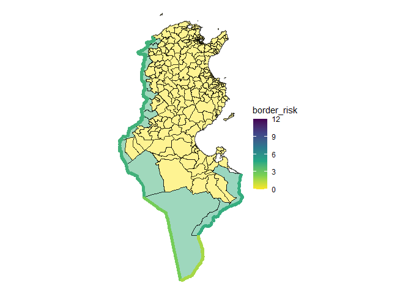

We can see that Remada has a risk of introduction weighted by border
lengths. The numbers shown along the borders are the emission risk
weighted by border lengths with neighbouring countries of Algeria and
Libya. As on Remada shares borders with both countries, it is the only
one with a weighted average.

### 4.2.2 Entry point risk

``` r
library(riskintroanalysis)
library(dplyr)

entry_points_fp <-
  system.file(
    package = "riskintrodata",
    "samples",
    "tunisia",
    "entry_points", "BORDER_CROSSING_POINTS.csv"
  )

entry_points <- readr::read_csv(entry_points_fp)
#> Rows: 110 Columns: 6
#> ── Column specification ────────────────────────────────────────────────────────
#> Delimiter: ","
#> chr (4): NAME, TYPE, MODE, SOURCES
#> dbl (2): LONGITUDE_X, LATITUDE_Y
#> 
#> ℹ Use `spec()` to retrieve the full column specification for this data.
#> ℹ Specify the column types or set `show_col_types = FALSE` to quiet this message.

entry_points <- validate_dataset_content(
  x = entry_points,
  table_name = "entry_points",
  point_name = "NAME",
  lng = "LONGITUDE_X",
  lat = "LATITUDE_Y",
  mode = "MODE",
  type = "TYPE",
  sources = "SOURCES"
) |> extract_dataset()

ri_entry_points <- calc_entry_point_risk(
  entry_points = entry_points,
  epi_units = tunisia,
  emission_risk = emission_risk_table
)
#> Warning: ! There are missing emission risk scores for the following countries:
#> • BIH missing for 1 entry points.
#> • BRN missing for 1 entry points.
#> • ESP missing for 1 entry points.
#> • FRA missing for 1 entry points.
#> • HUN missing for 2 entry points.
#> • ISR missing for 1 entry points.
#> • MAR missing for 1 entry points.
#> • NOR missing for 1 entry points.
#> • PAN missing for 1 entry points.
#> • PER missing for 1 entry points.
#> • PHL missing for 1 entry points.
#> • VNM missing for 1 entry points.
#> • ZAF missing for 1 entry points.
#> Create new entries in the emission risk factor table using `erf_row()`
#> (`?riskintrodata::erf_row()`).

plot_risk(ri_entry_points)
```

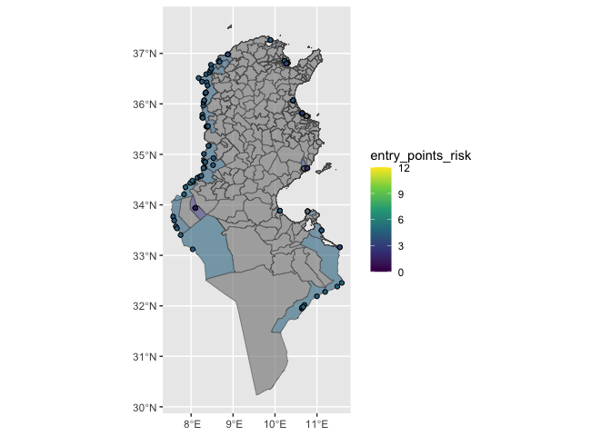

All epi units containing an entry point (with an associated weighted
emission risk) now have a risk of introduction based on the points
within its area.

### 4.2.3 Animal mobility

``` r
library(riskintroanalysis)
animal_mobility_fp <- system.file(package = "riskintrodata", "samples", "tunisia", "animal_mobility", "ANIMAL_MOBILITY_raw.csv")

animal_mobility_raw <- readr::read_csv(animal_mobility_fp)
#> Rows: 112 Columns: 11
#> ── Column specification ────────────────────────────────────────────────────────
#> Delimiter: ","
#> chr (6): ORIGIN_NAME, ORIGIN_COUNTRY, ORIGIN_ISO3, DESTINATION_NAME, DESTINA...
#> dbl (5): ORIGIN_LONGITUDE_X, ORIGIN_LATITUDE_Y, DESTINATION_LONGITUDE_X, DES...
#> 
#> ℹ Use `spec()` to retrieve the full column specification for this data.
#> ℹ Specify the column types or set `show_col_types = FALSE` to quiet this message.

animal_mobility <- validate_dataset_content(
  x = animal_mobility_raw,
  table_name = "animal_mobility",
  o_name = "ORIGIN_NAME",
  o_lng = "ORIGIN_LONGITUDE_X",
  o_lat = "ORIGIN_LATITUDE_Y",
  d_name = "DESTINATION_NAME",
  d_lng = "DESTINATION_LONGITUDE_X",
  d_lat = "DESTINATION_LATITUDE_Y",
  quantity = "HEADCOUNT"
) |> extract_dataset()

ri_animal_mobility <- calc_animal_mobility_risk(
  animal_mobility = animal_mobility,
  emission_risk = emission_risk_table,
  epi_units = tunisia,
  method = "mean"
)
#> Warning: ! There are missing emission risk scores for the following countries:
#> • CAN missing for 1 animal mobility flows.
#> • PER missing for 1 animal mobility flows.
#> • SEN missing for 1 animal mobility flows.
#> Create new entries in the emission risk factor table using `erf_row()`
#> (`?riskintrodata::erf_row()`).

plot_risk(ri_animal_mobility)
```

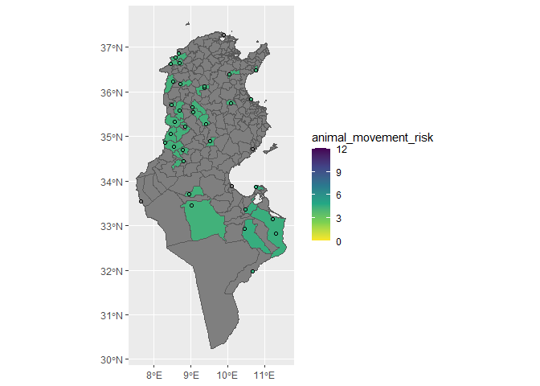

Some points remain grey indicating that the country from which the flow
comes does not have an entry in the emission risk factors table.

### 4.2.4 Road accessibility

Road access risk is calculated from the road accessibility raster file,
a global raster that contains data of distance from roads. This data is
aggregated over each epidemiological unit of Tunisia.

``` r
library(riskintroanalysis)
library(dplyr)
library(terra)
#> Warning: package 'terra' was built under R version 4.5.1
#> terra 1.8.60

riskintrodata::init_riskintrodata_cache()
#> [1] "/Users/davidgohel/Library/Application Support/org.R-project.R/R/riskintrodata"
road_raster_fp <- riskintrodata::download_road_access_raster()
road_raster <- terra::rast(road_raster_fp)

ri_road_access <- calc_road_access_risk(
  epi_units = tunisia,
  road_access_raster = road_raster,
  aggregate_fun = "mean"
)

plot(
  extract_raster(ri_road_access),
  main = "Raster cropped to epidemiological units"
)
```

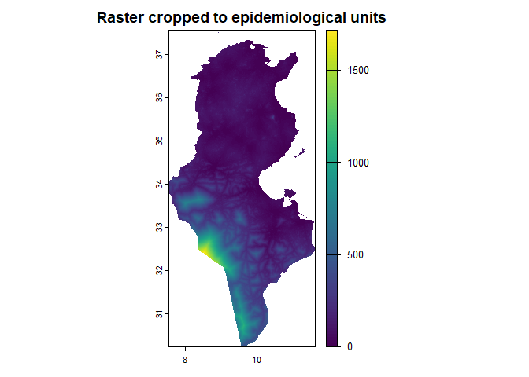

``` r


plot_risk(ri_road_access)
```

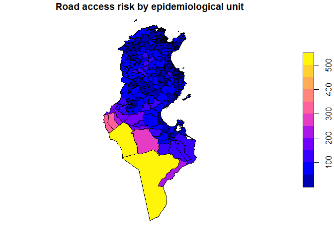

This shows us what the raster data looks like for Tunisia. Now we will
aggragate these values over each administrative area. Here, mean is
used.

The output shows the road access risk associated with each
epidemiological unit.

## 4.3 Risk rescaling

Once all the analysis methods have given a result, we need to be able to
compare them. Notably, road access risk is not on the same 0 to 12 scale
as the other three analyses. You might also want to add your own risk
scores using other methods.

To make sure we can compare across risks, riskintro proposes the
`rescale_risk` function, whose primary purpose is to normalise risk
scores to a range between 0 and 100. Its secondary role is to transform
the risk distribution using quadratic, exponential or sigmoid functions
(and inverse versions of these). Other options include reversing the
scaling as well.

A linear transformation looks like the following. This uses the maximum
value of `road_access_risk` as the top of the range, whereas it could be
better to take the global maximum in the raster if you are intending to
comparing across countries later.

``` r
rescaled <- rescale_risk_scores(
  dataset = ri_road_access,
  cols = "road_access_risk",
  from = c(0, max(ri_road_access$road_access_risk)),
  to = c(0, 100),
  method = "linear",
  names_to = "scaled_road_access_risk",
  keep_cols = TRUE
)
plot(rescaled$road_access_risk, rescaled$scaled_road_access_risk)
```

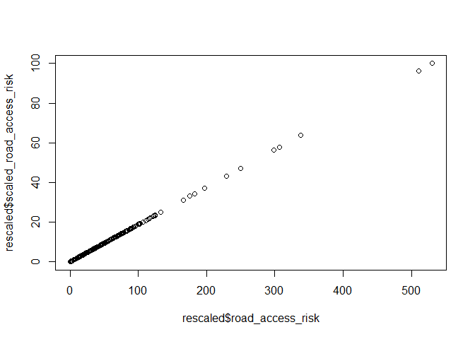

While a sigmoid transformation looks like the below. The choice of the
`method` argument are left up to the judgement of the analyst.

Note that a risk dataset ouput from one of the 4 default risk analyses
will detect which column to scale. The `cols` and `names_to` arguments
are not required.

``` r
ri_road_access_scaled <- rescale_risk_scores(
  data = ri_road_access,
  from = c(0, max(ri_road_access$road_access_risk)),
  method = "sigmoid",
  keep_cols = FALSE
)
```

## 4.4 Non-default risks

Riskintro also provides more generic workflows for adding any sort of
risk scores to a risk table alongside the default risk.

### 4.4.1 Risk from raster file

First, import or generate the raster data to use for analysis. This
example generates fictitious water courses in Tunisia which could be a
source of introduction risk.

``` r
library(terra)
tun_ext <- ext(6, 12, 30, 38)
r_tun <- rast(tun_ext, res = 0.1, crs = "EPSG:4326")
wkt_lines <- c(
  "LINESTRING (9.0 36.0, 9.5 35.0, 10.0 34.5)",
  "LINESTRING (8.5 33.5, 9.0 33.0, 10.0 32.5)"
)
water_sv <- vect(data.frame(wkt = wkt_lines),
  geom = "wkt",
  crs  = "EPSG:4326"
)
water_sv$water <- 1
water_rast <- rasterize(
  water_sv,
  r_tun,
  field      = "water",
  background = 0
)
plot(water_rast, main = "Example watercourses")
plot(tunisia, add = TRUE, color = "red")
```

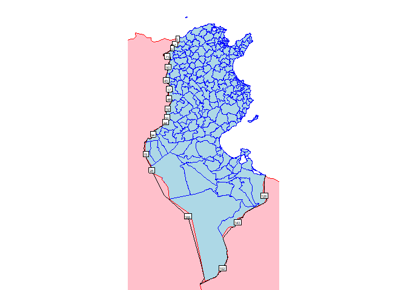

``` r
ri_water <- augment_epi_units_with_raster(
  epi_units = tunisia,
  raster = water_rast,
  risk_name = "water_risk",
  aggregate_fun = "mean"
) |>
  rescale_risk_scores(
    cols = "water_risk",
    from = c(0, 1),
    to = c(0, 100),
    method = "quadratic"
  )

ggplot(ri_water) +
  geom_sf(aes(fill = water_risk)) +
  scale_fill_viridis_c(limits = c(0, 100))
```

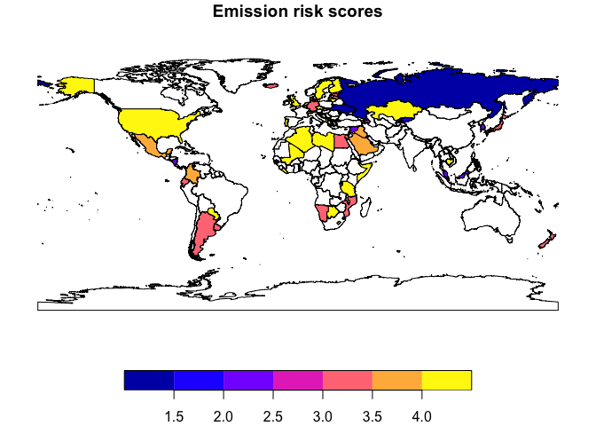 \###
Pre-calculated risk

In the case an analyst already has a dataset will risk scores for each
epidemiolocal unit, it is possible to simply join this dataset to the
risk table assuming that:

1.  a correct join key exists in the pre-calculated dataset and,
2.  there is no more an one risk score associated with each
    epidemiological unit.

Here we generate a dataset from a random uniform distribution

``` r
ri_random <- tunisia |>
  select(my_key = eu_id) |>
  mutate(
    ri_random = runif(nrow(tunisia), min = 0, max = 100)
  ) |>
  filter(row_number() <= 30) |>
  rescale_risk_scores(
    cols = "ri_random",
    from = c(0, 100), to = c(0, 100), method = "sigmoid"
  )
```

## 4.5 Summary table

Once all the risk methods have been compiled and scaled similarly, it
can be handy to have them all in one table. Each row is an
epidemiological unit and its various risks scores.

``` r
# initialise the risk_table
rt <- risk_table(tunisia, scale = c(0, 100))
# Add risks that have already been rescaled
rt <- add_risk(risk_table = rt, risk_data = ri_road_access_scaled)
rt <- add_risk(risk_table = rt, risk_data = ri_water)
rt <- add_risk(risk_table = rt, risk_data = ri_random, join_by = "my_key")

# add other risks, rescaling them as needed
rt <- add_risk(
  risk_table = rt,
  risk_data = rescale_risk_scores(
    dataset = ri_entry_points,
    method = "sigmoid"
  )
)

rt <- add_risk(
  risk_table = rt,
  risk_data = rescale_risk_scores(
    dataset = ri_borders
  )
)

rt <- add_risk(
  risk_table = rt,
  risk_data = rescale_risk_scores(
    dataset = ri_animal_mobility
  )
)
summarised_risks <- summarise_risk_scores(rt, method = "max")

plot_risk(summarised_risks)
```

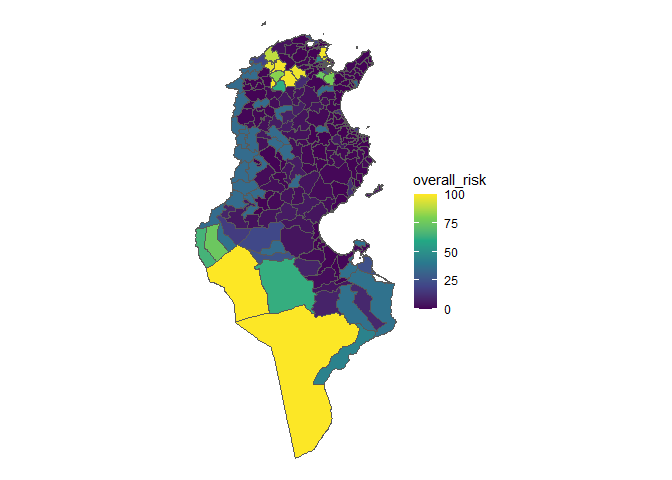
