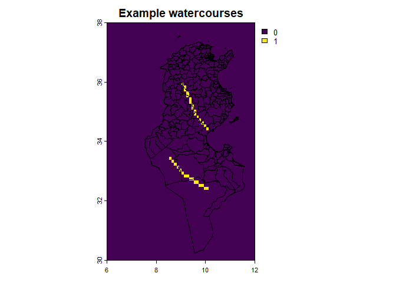
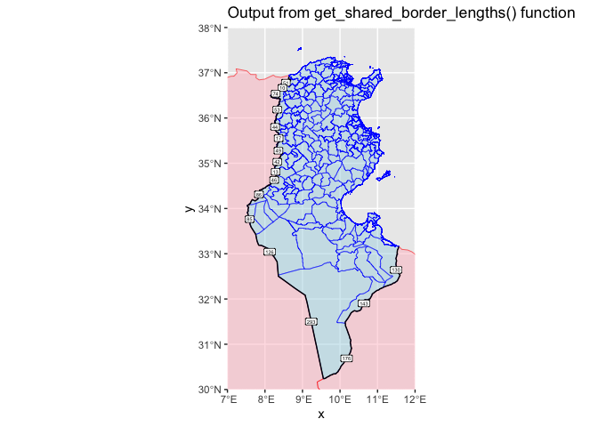

<!-- README.md is generated from README.Rmd. Please edit that file -->

# riskintroanalysis

<!-- badges: start -->
<!-- badges: end -->

The riskintroanalysis R package provides functions to analyse the risk
of introduction of animal diseases within a geographic area. It is
intended to be useful as a stand-alone package, but also to integrate
directly into the riskintro Rshiny app. The motivation behind these
projects is to easily conduct geospatial risk analysis using existing
data from WAHIS (World Animal Health Information System).

## Installation

You can install the development version of riskintroanalysis like so:

``` r
remotes::install_github("riskintroanalysis")
```

## Dev notes!!

Functions required:

1.  Calculate Risk of Introduction score from emission risk factors.
2.  Functions for validation dataset
3.  Functions for easily tidying datasets so they are valid
4.  Functions to go through each analysis (listed below) using validated
    datasets

See analysis examples to develop.

## Analysis

The package provides functions for certain risk of introduction
analysis, but requires external data to be provided. The functions are
inteded to be flexible, but each analytical method requires the
corresponding data.

The RShiny app [riskintro](https://github.com/ardata-fr/riskintro)
provides a graphical interface for the following analyses.

The central datasets to each method are:

1.  **The emission risk score table**, which provides a risk of emission
    diseases (that is to say the risk of a disease spreading from that
    country). This score is based on summary of risk factors, many of
    which are available from WAHIS (see more
    [here](insert%20link%20to%20riksintrodata%20package%20docs)). This
    data exists for many countries around the world, and is augmented
    with geospatial data corresponding to each country’s administrative
    boundaries.
2.  **The area of interest**, Geospatial data defining the borders of a
    region. This is the area for which we want to know the risk of
    introduction of a disease. The most common data is that of a country
    and its administrative boundaries, including internal boundaries.
    For example, French departments, or German states.

These two datasets are compared against each other through the following
analyses:

1.  **Border lengths**: using the length of shared borders the risk of
    introduction is weighed comared to each neighbouring country and
    their risk score.
2.  **Border entry points**: using an additional dataset that defines
    broder entry points, risk of introduction is weighted by legality of
    entry point.
3.  **Animal mobility**: using an additional dataset defining legal
    animal commerce flows, risk of introduction is weighed based on the
    number of animals entering the area.
4.  **Road access risk**: using raster data of the world, applied to the
    area of interest, risk of introdcution is infered through road
    acces. An area more accessible by road is considered higher risk.

These methods of analysis are intended to be used together or
individually to montor is risk of introduction.

# Example 1: Tunisia

## Core datasets

### Emission Risk Factors:

Emission risk factors are used to create an overall emission risk value
that is associated with the possible spread of a disease from that
country. It is made up of multiple scores which are weighted.

Here, we create two entries in the emission risk table for Algeria and
Libya. The absence of government oversight in each area represents an
increased risk of emission. Therefore a 1 means there is additional risk
associated with this score, and a 0 means no additional risk.

``` r

library(dplyr)
#> 
#> Attaching package: 'dplyr'
#> The following objects are masked from 'package:stats':
#> 
#>     filter, lag
#> The following objects are masked from 'package:base':
#> 
#>     intersect, setdiff, setequal, union
library(riskintroanalysis)
#> Loading required package: ggplot2
library(sf)
#> Linking to GEOS 3.13.1, GDAL 3.11.0, PROJ 9.6.0; sf_use_s2() is TRUE

algeria <- erf_row(
  iso3 = "DZA",
  country = "Algeria",
  disease = "Avian infectious laryngotracheitis",
  animal_category = "Domestic",
  species = "Birds",
  disease_notification = 0,
  targeted_surveillance = 1,
  general_surveillance = 0,
  screening = 1,
  precautions_at_the_borders = 1,
  slaughter = 1,
  selective_killing_and_disposal = 1,
  zoning = 1,
  official_vaccination = 1,
  last_outbreak_end_date = as.Date("30/06/2023"),
  commerce_illegal = 0L,
  commerce_legal = 0L
)
#> ✔ All data in "emission_risk_factors" valided.

libya <- erf_row(
  iso3 = "LBY",
  country = "Libya",
  disease = "Avian infectious laryngotracheitis",
  animal_category = "Domestic",
  species = "Birds",
  disease_notification = TRUE,
  targeted_surveillance = 1,
  general_surveillance = 0,
  screening = 1,
  precautions_at_the_borders = 0,
  slaughter = 1,
  selective_killing_and_disposal = 1,
  zoning = 1,
  official_vaccination = 1,
  last_outbreak_end_date = as.Date("30/06/2019"),
  commerce_illegal = 0L,
  commerce_legal = 1
)
#> ✔ All data in "emission_risk_factors" valided.

wahis_erf <- get_wahis_erf(
    disease = "Avian infectious laryngotracheitis",
    animal_category = "Domestic",
    species = "Birds"
  )

emission_risk_factors <- dplyr::bind_rows(
  algeria, 
  libya,
  wahis_erf
  )

emission_risk_table <- calc_weighted_emission_risk(emission_risk_factors = emission_risk_factors)

hist(
  emission_risk_table$emission_risk,
  main = "Histogram of emission risk score",
  xlab = "Emission risk scores"
)
```


It is also useful to join the world_sf geospatial dataset to emission
risk for later.

``` r

world <- riskintrodata::world_sf

emission_risk_sf <- dplyr::left_join(
  x = world, y = emission_risk_table, 
  by = c("iso3" = "iso3")
)

plot(select(emission_risk_sf, emission_risk), 
     main = "Emission risk scores")
```


### Area of interest (epidemiological units)

Epidemiological units (or epi units for short) is the term used for
geographical areas of interests for analysing understand the risk of
introduction. This data has no defaults and needs to be provided by the
user, however packages like `geodata` can be used to get them. For this
example, a shapefile containing the administrative boundaries of Tunisia
exists in the `riskintrodata` package for demonstration purposes.

The Tunisia epidemiological units dataset will be essential to the
following analysis methods.

``` r
# Example with raw sf files, previously downloaded with geodata::gadm()
tunisia_raw <- read_sf(system.file(
  package = "riskintrodata",
  "samples", "tunisia", "epi_units", "tunisia_adm2_raw.gpkg"
   ))

# Apply mapping to prepare colnames and validate dataset
tunisia <- apply_mapping(
  tunisia_raw,
  mapping = mapping_epi_units(
    eu_name = "NAME_2",
    geometry = "geom"
  ),
  validate = TRUE
)
#> ✔ All data in "epi_units" valided.

plot(sf::st_geometry(tunisia))
```


What’s left after using `apply_mapping()` is the required “epi_units”
dataset that is compatible with the rest of the analysis going forward.

## Analysis

The 4 methods of analysis provided by the package are detailed below:

This an example of analysing the risk of introduction for Tunisian
governorates.

### Risk of introduction through land borders:

Required datasets:

1.  epi units
2.  internal neighbours table
3.  emission risk table

The border length method calculates the risk of introduction of an
animal disease for a certain species based on shared land borders. In
this example, we see Tunisia shares land borders with Algeria and Libya
(this is why entries of these two countries were added to the emission
risk table above).

Risk of introduction through land borders is the risk of emission from
of bordering countries weighted by the length of the shared border. If
an epi unit only has one bordering country with emission risk X, then
the epi units risk of introduction is also X. If two bordering countries
exist with emission risk Y ans Z, then the risk of introduction is a
weighted average of Y and Z, with more importance given to the country
with the longer border.

The analysis method starts with finding shared borders between epi units
and bordering countries, which requires an algoithm align borders.

``` r
tun_neighbours <- riskintrodata::neighbours_table |> 
  filter(country_id == "TUN")

bordering_countries <- world |> 
  filter(iso3 %in% tun_neighbours$neighbour_id)

# Run function to get shared borders
shared_borders <- calc_shared_border_lengths(
  epi_units = tunisia,
  eu_id_col = "eu_id",
  bordering_countries = bordering_countries,
  bc_id_col = "iso3"
)
#> Warning: attribute variables are assumed to be spatially constant throughout
#> all geometries
#> Warning: attribute variables are assumed to be spatially constant throughout
#> all geometries
#> Spherical geometry (s2) switched off
#> although coordinates are longitude/latitude, st_union assumes that they are
#> planar

ggplot() +
  geom_sf(data = bordering_countries, colour = "red", fill = "pink", alpha = 0.5) +
  geom_sf(data = tunisia, fill = "lightblue", colour = "blue", alpha = 0.5) +
  geom_sf(data = shared_borders, colour = "black") +
  geom_sf_label(data = shared_borders, aes(label = round(border_length)), size = 1.5) +
  coord_sf(xlim = c(7, 12), ylim = c(30,38), expand = FALSE) + 
  labs(
    title = "Output from get_shared_border_lengths() function "
  )
#> Warning in st_point_on_surface.sfc(sf::st_zm(x)): st_point_on_surface may not
#> give correct results for longitude/latitude data
```

 The
main purpose of the function is to correct misaligned borders, as can be
seen in the overlaps and divergent borders. The epi units data is used
as the “true” border, as geospatial data from different sources are
rarely well aligned.

A border length has been calculated for each epi unit that a foreign
country. For most of these areas, the risk of introduction will simply
equal the emission risk of the neighbouring country, with the exception
of Tunisia’s southern most governorate. Which will have an emission risk
weighed by the border lengths or each neighbour.

``` r
eu_border_risk_intro <- calc_weighted_border_risk(
  epi_units = tunisia, 
  shared_borders = shared_borders,
  emission_risk = emission_risk_table
  )

plot(select(eu_border_risk_intro, border_risk) |> 
       mutate(border_risk = as.factor(round(border_risk, 1))), 
     main = "Weighted risk of introduction useing border method")
```


### Entry point method:

``` r
library(riskintroanalysis)
library(dplyr)

entry_points_fp <-
  list.files(
    system.file(
      package = "riskintrodata",
      "samples",
      "tunisia",
      "entry_points"
    ),
    full.names = TRUE
  )

entry_points <- readr::read_csv(entry_points_fp)
#> Rows: 110 Columns: 6
#> ── Column specification ────────────────────────────────────────────────────────
#> Delimiter: ","
#> chr (4): NAME, TYPE, MODE, SOURCES
#> dbl (2): LONGITUDE_X, LATITUDE_Y
#> 
#> ℹ Use `spec()` to retrieve the full column specification for this data.
#> ℹ Specify the column types or set `show_col_types = FALSE` to quiet this message.

entry_points <- apply_mapping(
  dataset = entry_points, 
  mapping = mapping_entry_points(
    point_name = "NAME", 
    lng = "LONGITUDE_X", 
    lat = "LATITUDE_Y", 
    mode = "MODE", 
    type = "TYPE", 
    sources = "SOURCES"
  ), 
  validate = TRUE
)
#> ✔ All data in "entry_points" valided.

results <- calc_entry_point_intro_risk(
  entry_points = entry_points,
  epi_units = tunisia,
  emission_risk = emission_risk_table
)
points_entry_point_intro_risk <- results$points
epi_units_entry_point_intro_risk <- results$epi_units

ggplot() +
  geom_sf(data = epi_units_entry_point_intro_risk,
          aes(fill = entry_points_risk)) +
  scale_fill_continuous(
    type = "viridis", 
    na.value="white",
    trans = 'reverse'
    ) +
  geom_sf(
    data = points_entry_point_intro_risk,
    size = 1, alpha = 0.5,
    aes(color = as.factor(round(emission_risk)))
    )
```



### Animal mobility method:

Considerations: 1. fix exports, need to export as much as possible. 1.
add “countries” package as dep and re-export country_name 1. Provide
tools to tidy data for analysis and validate datasets at the start of
each function. 1. Do we continue to include lealfet labels in output? 1.
create plot.generics for each output to a basic plot or leaflet? 1
Combine calc_animal_mobility_point_risk and calc_animal_mobility_eu_risk
into one function?

``` r
library(riskintroanalysis)
animal_mobility_fp <- system.file(package = "riskintrodata", "samples", "tunisia", "animal_mobility", "ANIMAL_MOBILITY_raw.csv")

animal_mobility_raw <- readr::read_csv(animal_mobility_fp)
#> Rows: 112 Columns: 11
#> ── Column specification ────────────────────────────────────────────────────────
#> Delimiter: ","
#> chr (6): ORIGIN_NAME, ORIGIN_COUNTRY, ORIGIN_ISO3, DESTINATION_NAME, DESTINA...
#> dbl (5): ORIGIN_LONGITUDE_X, ORIGIN_LATITUDE_Y, DESTINATION_LONGITUDE_X, DES...
#> 
#> ℹ Use `spec()` to retrieve the full column specification for this data.
#> ℹ Specify the column types or set `show_col_types = FALSE` to quiet this message.

animal_mobility <- apply_mapping(
  animal_mobility_raw,
  mapping = mapping_animal_mobility(
    o_name = "ORIGIN_NAME",
    o_lng = "ORIGIN_LONGITUDE_X",
    o_lat = "ORIGIN_LATITUDE_Y",
    d_name = "DESTINATION_NAME",
    d_lng = "DESTINATION_LONGITUDE_X",
    d_lat = "DESTINATION_LATITUDE_Y",
    quantity = "HEADCOUNT"
  )
)
#> ✔ All data in "animal_mobility" valided.

analysis_point <- calc_animal_mobility_point_risk(
  animal_mobility = animal_mobility, 
  emission_risk = emission_risk_table, 
  country_iso3 = "TUN"
    )

analysis_output <- calc_animal_mobility_eu_risk(
  animal_mobility_points = analysis_point, 
  epi_units = tunisia, 
  method = "mean"
  )

ggplot() +
  geom_sf(data = analysis_output, aes(geometry = geometry, fill = animal_movement_risk)) +
    scale_fill_continuous(
    type = "viridis", 
    na.value="white",
    trans = 'reverse'
    ) +
  geom_sf(data = analysis_point, color = "red", size = 1.5)
```


### Road accessibility method:

``` r
# library(riskintroanalysis)
```
